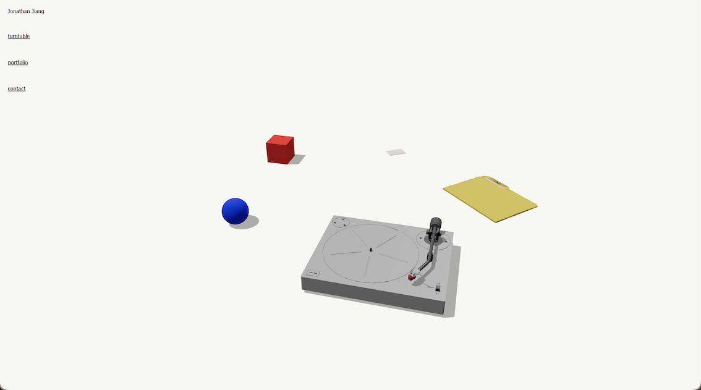
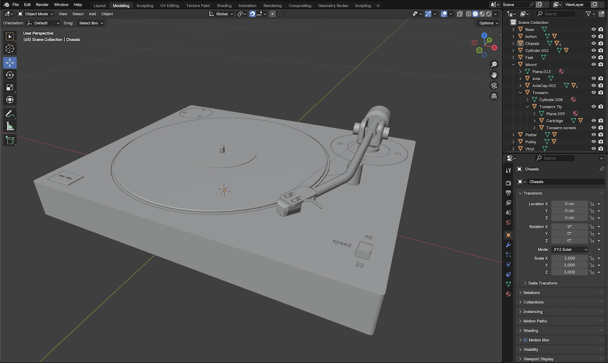

## Personal Portfolio
**Three.js**, **TypeScript**
[jiangjonathan.com](https://jiangjonathan.com)    [github](https://github.com/jiangjonathan/portfolio)

### Overview
My portfolio website uses vanilla TypeScript, Three.js for 3D, and Vite for frontend tooling. The visual language for the site is intentionally minimal, with the purpose to emphasize the interaction with 3D models. UI text uses artificial subpixel colour fringing and disabled font smoothing to mimic rough, chromatic text seen on older monitors mid to early 2000s.

The site is organized into multiple "pages", each corresponding to a specific 3D object. The "Home" page is the default view, and provides an orbiting view of all objects I have currently built. At the moment, there are three completed pages: the turntable, portfolio, and contact (business card). All pages share a single Three.js scen; they are differentiated by page-specific camera positions, model visibility, and DOM layouts. 

### Turntable Page

The turntable model in my website is a conceptual hidden belt-drive turntable. This would be a nightmare for maintenance if it existed in real life, but I was drawn to the clean aesthetic of the turntable platter and flywheel being flush with the chassis.

#### Design
When sketching and drafting the design for the turntable, I leaned into a minimal and clean design. Some of my influences in the design include the Bang & Olufsen Beogram 6000, Pro-Ject turntables, Teenage Engineering TP-7, and modern Apple devices. The start-stop button for example was inspired from those found on Technics turntables. The cartridge design was inspired from geometric Ortofon cartridges.

#### Function
All "songs" in the library are sourced from YouTube, and the player is implemented using YouTube iframe API. Song covers, release, and genre metadata are fetched using a script that parses the YouTube video name to extract artist and song name. These are then parsed into a script that queries MusicBrainz and CoverArtArchive, allowing for accurate metadata and cover art for the records, even when the YouTube video itself lacks that metadata. 

#### Behaviour
For the turntable page in my website, I didn't want it to be a standard music player. Spotify and Apple Music already exist for that. Instead, I wanted to provide a more interactive and immersive experience. For the music selection process, users must browse a list of records, "open" a record, then physically place the vinyl onto the turntable platter. To play the record, users also must press the turntable's start button, then manually drag the tonearm onto the edge of the vinyl before the needle can be dropped. 

Once the record is playing, the tonearm dynamically tracks across the vinyl based on the song's progress, allowing users to scrub the track by moving the tonearm. When the needle is dropped as the song plays, the tonearm starts bobbing, and the vinyl itself exhibits slight warp and wobble. I incorporated these small details to help the interaction feel authentic.

Realism was a core principle I pursued in my design of the experience. UI elements such as the player timeline are intentionally non-scrubbable with the mouse. I wanted all the interaction to be with the 3D model, like handling a real record and turntable. And while vinyl records shouldn't show video, hiding the YouTube iframe for the player would be a waste. Many songs have excellent music videos, and they could heighten the experience, adding atmosphere, which is why I leaned into it and implemented a fullscreen mode for the player.

### Portfolio Page
The portfolio page on my website is designed after the classic yellow folder/dossier, and inside it holds my resume, as well as documentation of some projects I have made, as "papers". These papers can include PDFs, HTML objects, and potentially more, overlaid as canvas textures onto a planar Three.js mesh. 

#### Function & Behaviour
When the portfolio page is clicked, the camera travels to a top-down view of the portfolio. The papers are stacked on each other, each given random slight rotations to appear natural. Papers can be browsed by clicking the left and right directional arrows. When they are shifted to the left of the portfolio, they also assume another random rotation, to give the realistic effect that they are being moved manually.  

### Contact Page (Business Card)
The design of the business card is just a simple Three.js mesh with text on it, with clickable links, functioning like a digital business card.

### More under construction
Future plans for this project include adding sound effects across the interaction for all objects. In the example of the turntable, I've considered adding vinyl crackle, but in high-end turntables such as the ones that inspired my design, these noises are largely absent. I am also considering changing the way users browse records, such as creating a digital "crate" browsing system.

There are probably also visible placeholder objects on my website. I am always building something new to add to my portfolio website to showcase my interests and create more experiences. 

Please enjoy.

*Disclaimer*
- *All models were modeled by me*
- *Album artwork and metadata are obtained from MusicBrainz under its public licensing terms*
- *All audio playback is delivered via official YouTube embed iframes, accessing content made publicly available on the YouTube platform*
- *This project is entirely non-commercial, non-profit, and used solely for personal and educational purposes*
